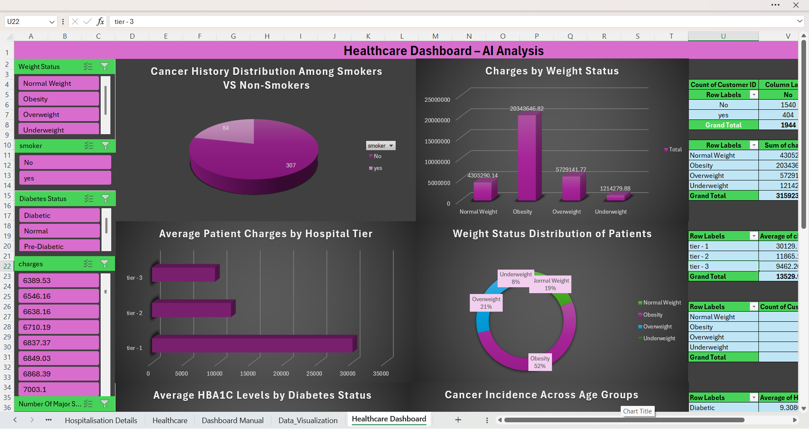

                                              📊 Healthcare Data Analytics Dashboard
🌟 Project Overview

This project presents a complete Healthcare Data Analytics Dashboard built using Microsoft Excel, showcasing end-to-end skills in data cleaning, transformation, analysis, pivot tables, Quick Analysis insights, and dashboard creation.
All three datasets were merged into a unified Healthcare sheet using XLOOKUP and data modeling.

📅 Date: 25 Nov 2025
👩‍💻 Author: Indhira S — Aspiring Data Analyst

📌 Dashboard Preview

🗃️ Dataset Fields
Field	Description
🆔 Customer ID	Unique identifier
👤 First Name	Patient’s name
⚖️ BMI	Body Mass Index
🩸 HBA1C	Glucose level indicator
❤️ Heart Issues	Yes/No
🏥 Any Transplants	Yes/No
🎗️ Cancer History	Yes/No
🔪 Major Surgeries	Number of surgeries
🚬 Smoker	Yes/No
⚖️ Weight Status	Underweight / Normal / Overweight / Obesity
🩺 Diabetes Status	Diabetic / Pre-Diabetic / Normal
🎂 Date of Birth	Cleaned and formatted DOB
💵 Charges	Hospitalization costs
🏥 Hospital Tier	Tier-1 / Tier-2 / Tier-3
🌆 City Tier	Tier classification
🆔 State ID	State-level identifier
🎯 Age	Calculated age (as of 8 June 2023)
🧹 Data Cleaning Steps

✔️ Replaced '?' missing values
✔️ Filled missing Month → September
✔️ Filled missing Year → Rounded average
✔️ Filled missing Smoker, City Tier, Hospital Tier → using MODE()
✔️ Missing State ID → filled with "Unknown"
✔️ Cleaned Major Surgeries → converted to numeric
✔️ Split patient name → Title, First Name, Last Name
✔️ Merged Year + Month + Date → DOB
✔️ Calculated Age using TODAY() logic
✔️ Formatted Charges as currency ($)

🧮 Key Formulas Used
🔧 Cleaning & Transformation
=IF(cell="?", "", cell)

=TEXT(DATE(Year, Month, Date),"DD-MMM-YYYY")

=INT((DATE(2023,6,8)-DOB)/365)

🔍 Lookup & Merge
=XLOOKUP(CustomerID, Table1[ID], Table1[Column])

📊 BMI → Weight Status
=IF(BMI<18.5,"Underweight",
IF(BMI<25,"Normal Weight",
IF(BMI<30,"Overweight","Obesity")))

📊 Dashboard Insights

🔸 Cancer History: Smokers vs Non-Smokers
Smokers show higher cancer incidence, indicating strong lifestyle-based risks.

🔸 Charges by Weight Status
Obese patients contribute the highest total healthcare spending.

🔸 Hospital Tier Analysis
Tier-3 hospitals show the highest average charges, indicating advanced care levels.

🔸 Diabetes & HBA1C
Higher HBA1C values correspond to diabetic patients, validating data accuracy.

🔸 Weight Status Distribution
Most patients fall under Obesity and Overweight categories.

🛠️ Tools Used

• Microsoft Excel
• Pivot Tables
• Pivot Charts (Pie, Doughnut, Column, Bar)
• Quick Analysis
• Slicers (Weight Status, Diabetes Status)
• Data Model + XLOOKUP

🏁 Conclusion

This Healthcare Dashboard demonstrates strong Excel analytics capabilities—from cleaning raw data to creating meaningful insights for medical and operational decision-making.

💼 Connect With Me

🔗 LinkedIn: https://www.linkedin.com/in/indhira4623
